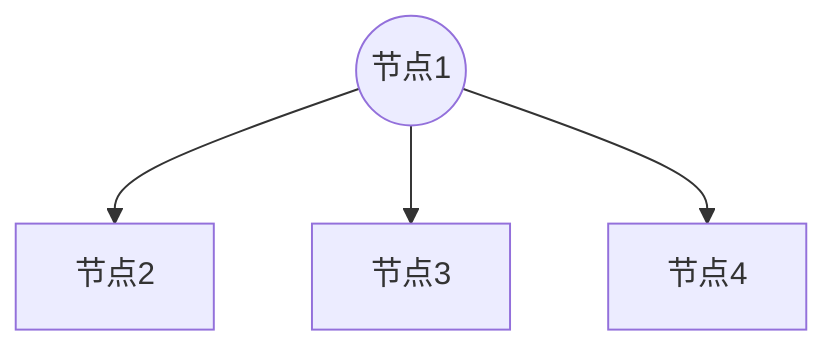
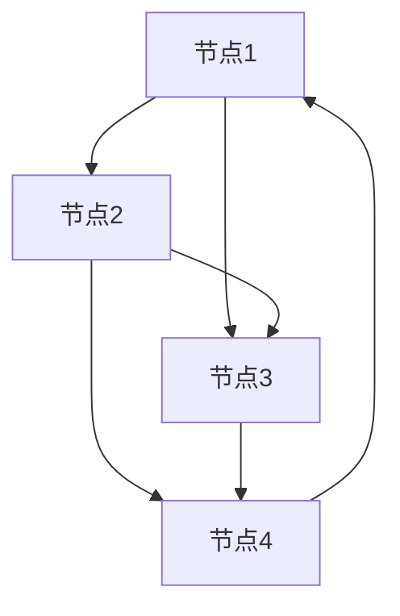

Welcome to [Hexo](https://hexo.io/)! This is your very first post. Check [documentation](https://hexo.io/docs/) for more info. If you get any problems when using Hexo, you can find the answer in [troubleshooting](https://hexo.io/docs/troubleshooting.html) or you can ask me on [GitHub](https://github.com/hexojs/hexo/issues).

## 绪论

### 什么是数据结构？

1、数据结构是是一项非常重要的技术，因为好的程序设计=好的数据结构+好的算法。因此掌握数据结构显得非常重要。

2、简单的来说数据结构就是关系，就是数据元素相互之间存在的一种或多种特定关系的集合。

3、传统上，我们把数据结构分为逻辑结构和物理结构。

（1）逻辑结构：是指数据对象中数据元素之间的相互关系。

（2）物理结构：是指数据的逻辑结构在计算机中的存储形式。

4、计算机中有4大逻辑结构：

（1）集合结构：（集合内的元素除具有某些相似特征外，无任何其他关系）

<button style="border: 1px solid #666; width: 100px; height: 100px; border-radius: 50%; text-align: center; line-height: 8px;display: block;margin-left: 40px">
.........</br>
.........</br>
.........</br>
.........</br>
</button>

（2）线性结构：（线性结构中的元素具有一对一的关系）

<div style="margin-left: 40px">
  <kbd>元素1</kbd>----><kbd>元素2</kbd>----><kbd>元素3</kbd>----><kbd>元素4</kbd>
</div>

（3）树形结构：（树形结构中的元素具有一对多的关系）



（4）图形结构：（图形结构中的元素具有多对多的关系）



5、说完逻辑结构，我们再来说说数据的物理结构。

（1）物理结构的定义，实际上就是研究如何把数据元素存储到计算机的存储器中。

存储器主要是针对内存而言的，像硬盘、软盘、光盘等外部存储器的数据组织通常用文件结构来描述。

（2）数据元素的存储结构形式有两种：顺序存储和链式存储。

- 顺序存储结构：是把数据元素存放在地址连续的存储单元里，其数据间的逻辑关系和物理关系是一致的。
- 例如我们编程语言的数组结构就是这样滴。

在日常生活中，排队跟顺序存储结构十分相似。但是排队有一个很大的弊病，就是你一旦离开队伍，在想回到原来的位置就变得很困难。这个时候就要提一手链式存储结构

链式存储结构类型现在的叫号系统，你只需取一张号，然后就可以忙别的了。就是你随便在什么位置，通过号码可以关联到你。这样就很灵活。

### 浅谈算法

1、数据结构和算法是很难分开的，如果只谈数据结构，会显的很没用，同样撇开数据结构只谈算法，又会觉得算法晦涩难懂。但是把二者结合你会发现，编码原来非常amazing

2、算法初体验，如何累加1-100

```
let num = 0;
for (let a = 1; a <= 100; a++>) {
  num += a;
}
```

```
const num = (1 + 100) * 100 / 2
```

3、是不是发现第二种方法比第一种效率高很多，这就是算法的魅力。

4、从概念上来讲，算法具有五大特征：输入、输出、有穷性、确定性和可行性。

（1）输入：
- 算法具有零个或多个输入。
- 尽管对于绝大多数算法来说，输入参数都是必要的。但是有些时候，像打印“123456”，就不需要啥参数啦。

（2）输出：
- 算法至少有一个或多个输出。
- 算法是一定要输出的，不需要它输出，那你要这个算法来干啥？输出的形式可以是打印形式输出，也可以是返回一个值或多个值等。

（3）有穷性：
- 指算法在执行有限的步骤之后，自动结束而不会出现无限循环，并且每一个步骤在可接受的时间内完成。一个永远都不会结束的算法，我们还要他来干啥？

（4）确定性：
- 算法的每一个步骤都具有确定的含义，不会出现二义性。
- 算法在一定条件下，只有一条执行路径，相同的输入只能有唯一的输出结果。

（5）可行性：
- 算法的每一步都必须是可行的，也就是说，每一步都能够通过执行有限次数完成。

5、虽然算法并不是唯一的，但是我们还是要掌握一些厉害算法，这样我们在处理某些复杂问题时才能游刃有余。正所谓吃一份饭干一份活，不要吃10份饭干一份活。

6、既然说到厉害算法那么什么才是厉害算法，一般具有一下特性

（1）正确性：
- 算法法的正确性是指算法至少应该具有输入、输出和加工处理无歧义性、能正确反映问题的需求、能够得到问题的正确答案。
- 大体分为以下四个层次：
> + 算法程序没有语法错误。
> + 算法程序对于合法输入能够产生满足要求的输出。
> + 算法程序对于非法输入能够产生满足规格的说明。
> + 算法程序对于故意刁难的测试输入都有满足要求的输出结果。

(2) 可读性:
- 算法设计另一目的是为了便于阅读、理解和交流。
- 我们写代码的目的，一方面是为了让计算机执行，但还有一个重要的目的是为了便于他人阅读和自己日后阅读修改。

（3）健壮性：
- 当输入数据不合法时，算法也能做出相关处理，而不是产生异常、崩溃或莫名其妙的结果。

（4）时间效率高和存储量低：
- 即用少产多

### 算法效率的度量方法

1、前文提到过，算法要尽量提高效率，这里的效率一般指算法的执行时间。

2、执行时间并不是真的要看程序的执行时间，因为外在的因素会影响到计算机的运行速度，因此一般通过复杂度来抽象表示。

3、复杂度分为时间复杂度和空间复杂度

4、时间复杂度可以理解为程序的执行次数

5、一般用大写O()来体现算法时间复杂度。

6、比如上面的两个例子的复杂度就是O(1)，O(n)

7、举个例子：

|  例子   | 时间复杂度  | 术语  |
|  ----  | ----  | ----  |
| 2342342  | O(1) | 常数阶 |
| 3n+4  | O(n) | 线性阶 |
| 3n^2+4n+5  | O(n^2) | 平方阶 |
| 3log(2)n+4  | O(logn) | 对数阶 |
| 2n+3nlog(2)n+14  | O(nlogn) | nlogn阶 |
| n^3+2n^2+4n+6 | O(n^3) | 立方阶 |
| 2^n | O(2^n) | 指数阶 |

8、常用的时间复杂度所耗费的时间从小到大依次是：O(1) < O(logn) < (n) < O(nlogn) < O(n^2) < O(n^3) < O(2^n) < O(n!) < O(n^n)

9、我们在写代码时，完全可以用空间来换去时间。

举个例子，要计算某年是不是闰年，第一种方法是通过计算获得，第二种方法是建一个有2050个元素的数组。虽然第二种方法不需要计算，通过索引即可获取结果，但却在空间上花费不小。

10、通常我们所说的复杂度指的也是时间复杂度。

### 线性表

1、线性表（List）：由零个或多个数据元素组成的有限序列。

- 首先它是一个序列，也就是说元素之间是有个先来后到的。

- 若元素存在多个，则第一个元素无前驱，而最后一个元素无后继，其他元素都有且只有一个前驱和后继。

- 另外，线性表强调是有限的。

2、如果用数学语言来进行定义，可如下：

- 若将线性表记为（a1,…,ai-1,ai,ai+1,…an）,则表中ai-1领先于ai,ai领先于ai+1,称ai-1是ai的直接前驱元素,ai+1是ai的直接后继元素。

- 所以线性表元素的个数n(n>=0)定义为线性表的长度，当n=0时，称为空表。

3、我们可以想象，线性表有两种物理存储结构：顺序存储结构和链式存储结构。

4、线性表的顺序存储结构，指的是用一段地址连续的存储单元依次存储线性表的数据元素。

- 有点类似数组，即可以通过下标直接获取到我们想要找的的元素。

- 线性表的顺序存储结构查找操作的复杂度为O(1)，但是删除，插入的复杂度为O(n)

- 优点：
  
> + 无须为表示表中元素之间的逻辑关系而增加额外的存储空间。
> + 可以快速地存取表中任意位置的元素。

- 缺点：

> + 插入和删除操作需要移动大量元素。
> + 当线性表长度变化较大时，难以确定存储空间的容量。
> + 容易造成存储空间的“碎片”。

5、线性表的链式存储结构的特点是用一组任意的存储单元存储线性表的数据元素，这组存储单元可以存在内存中未被占用的任意位置。

- 相比顺序存储结构，需要额外存储一个指针信息。来指示其后继元素的位置。

```
function LinkedList() {
    function Node(ele) {
        this.ele = ele;
        this.next = null;
    }

    let length = 0;              // 计数器变量
    let head = new Node('head'); // 头节点
    let popEle;

    //向尾部追加元素
    this.append = function (ele) {
        let node = new Node(ele),
            temp; //临时指针

        temp = head;
        while (temp.next) {
          temp = temp.next
        }
        temp.next = node;
        length++;
        popEle = node;
        return true;
    }

    this.getPopEle = function() {
      return popEle;
    }

    //插入到指定位置
    this.insert = function (position, ele) {
        if (position >= 0 && position < length) {
            let node = new Node(ele),
                temp = head,
                index = 0,
                previous;

            if (position == 0) {
                node.next = temp;
                head = node;
            } else {
                while (index++ < position) {
                    previous = temp;
                    temp = temp.next;
                }
                node.next = temp;
                previous.next = node;
            }
            length++;
            return true;
        } else {
            return false;
        }
    }

    //删除指定位置元素
    this.removeAt = function (position) {
        if (position > -1 && position < length) {
            let temp = head,
                previous,
                index = 0;

            if (position == 0) {
                head = head.next;
            } else {
                while (index++ < position) {
                    previous = temp;
                    temp = temp.next;
                }

                previous.next = temp.next;
            }
            length--;
            return temp.ele;
        } else {
            return null;
        }
    }

    //删除所有值为ele的元素
    this.removeEle = function (ele) {
        let temp = head,
            previous,
            num = 0;
        if (ele == temp.ele) {
            head = head.next;
            length--;
            num++;
        }

        while (temp.next) {
            previous = temp;
            temp = temp.next;
            if (temp.ele == ele) {
                previous.next = temp.next;
                length--;
                num++;
            }
        }
        return num;
    }

    //删除最后一个元素
    this.pop = function () {
        let temp = head,
            previous = temp;
        if (length < 1) {
            return false;
        }
        if (length == 1) {
            head = new node('head');
            length = 0;
            return temp.ele;
        }
        while (temp.next) {
            previous = temp;
            temp = temp.next;
        }
        previous.next = null;
        length--;
        return temp.ele;
    }

    this.indexOf = function (ele) {
        let temp = head,
            index = 0;

        while (temp) {
            if (temp.ele == ele) {
                return index;
            }
            temp = temp.next;
            index++;
        }
        return -1;

    }

    this.toString = function () {
        let temp = head,
            string = '';

        while (temp) {
            string += temp.ele + ' ';
            temp = temp.next;

        }
        return string;
    }
    this.length = function () {
        return length;
    }
    this.isEmpty = function () {
        return length === 0;
    };
    this.getHead = function () {
        return head;
    }
}

let mylist = new LinkedList();
mylist.append('A');
mylist.append('B');
mylist.append('C');
mylist.append('D');
mylist.append('C');
mylist.append('B');
mylist.append('A');
console.log(mylist.toString());
console.log(mylist.pop());
console.log(mylist.toString());
console.log('移除%d个C', mylist.removeEle('C'));
console.log(mylist.toString());
console.log(mylist.length());
console.log(mylist.getHead());

console.log(mylist.indexOf('C'))
```

6、效率PK：
- 我们最后的环节是效率PK，我们发现无论是单链表插入还是删除算法，它们其实都是由两个部分组成：第一部分就是遍历查找第i个元素，第二部分就是实现插入和删除元素。
- 从整个算法来说，我们很容易可以推出它们的时间复杂度都是O(n)。
- 再详细点分析：如果在我们不知道第i个元素的指针位置，单链表数据结构在插入和删除操作上，与线性表的顺序存储结构是没有太大优势的。

- 但如果，我们希望从第i个位置开始，插入连续10个元素，对于顺序存储结构意味着，每一次插入都需要移动n-i个位置，所以每次都是O(n)。

- 而单链表，我们只需要在第一次时，找到第i个位置的指针，此时为O(n)，接下来只是简单地通过赋值移动指针而已，时间复杂度都是O(1)。

- 显然，对于插入或删除数据越频繁的操作，单链表的效率优势就越是明显

### 静态链表

1、用数组描述的链表叫做静态链表，这种描述方法叫做游标实现法。

- 意思就是在没有指针的时候，如何使用数组来模拟链表

2、结构：

|  游标   | 5  | 2  | 3 | 4 | 0  | 6  | 7 | ··· | 1 |
|  ----  | ----  | ---- |  ----  | ----  | ---- |  ----  | ----  | ---- | ---- |
| 数据  |  | A | B | C | D |  |  |  |  |
| 下标  | 0 | 1 | 2 | 3 | 4 | 5 | 6 | ··· | 999 |

3、约定：

- 我们对数组的第一个和最后一个元素做特殊处理，他们的data不存放数据。
- 我们通常把未使用的数组元素称为备用链表。
- 数组的第一个元素，即下标为0的那个元素的cur就存放备用链表的第一个结点的下标。
数组的最后一个元素，即下标为MAXSIZE-1的cur则存放第一个有数值的元素的下标，相当于单链表中的头结点作用。

```
function SLinkList(MAXSIZE) {
  this.MAXSIZE = MAXSIZE || 1000;
  for (let a = 0; a < MAXSIZE - 1; a++) {
    this[a] = {};
    this[a].cur = a + 1;
  }
  this[MAXSIZE - 1] = 0;
}

SLinkList.prototype = {
  /**
   * 在静态单链线性表插入数据
   * @param data
   */
  push: function(data) {
    if (this[0].cur >= this.MAXSIZE - 1) {
      retur false;
    }
    const firstStaticListFirstEle = this[0].cur;
    const nextIdleSpaceCursor = this[firstStaticListFirstEle].cur;
    this[firstStaticListFirstEle] = {
      data,
      cur: 0,
    };
    this[0].cur = nextSpaceCursor;
  },
  /**
   * 在静态单链线性表L中查找第1个值为e的元素，
   * 若找到，则返回它在L中的位序
   * @param data
   */
  locateElem: function (data) {
    var i = this[this.MAXSIZE - 1].cur;
    while (i && this[i].data !== data) {
      i = this[i].cur;
    }
    return i;
  },
  /**
   * 将一维数组中各分量链成一个备用链表
   * this[0].cur为头指针
   */
  initSpace: function () {
    for (var i = 0; i < this.MAXSIZE - 1; ++i) {
      this[i] = this[i] || {};
      this[i].cur = i + 1;
    }

    this[this.MAXSIZE - 1] = this[this.MAXSIZE - 1] || {};
    this[this.MAXSIZE - 1].cur = 1;
  },
  /**
   * 若备用链表非空，则返回分配的结点下标，反则返回0
   * @returns {*}
   */
  malloc: function () {
    var i = this[0].cur;
    if (this[0].cur) this[0].cur = this[i].cur;
    return i;
  },
  /**
   * 将下标为k的空闲结点回收到备用链表
   * @param k
   */
  free: function (k) {
    this[k].cur = this[0].cur;
    this[0].cur = k;
  },
  /**
   * 在一维数组中建立表示集合(A-B)U(B-A)
   * 的静态链表，s为其头指针。
   * @returns {*}
   */
  difference: function (arr1, arr2) {
    // 初始化备用空间
    this.initSpace();
    // 生成s的头结点
    var s = this.malloc();
    // r指向s的当前最后结点
    var r = s;
    // 删除A和B的元素个数
    var m = arr1.length;
    var n = arr2.length;

    // 建立集合A的链表
    for (var j = 0; j < m; ++j) {
      //分配结点
      var i = this.malloc();
      // 输入A元素的值
      this[i].data = arr1[j];
      // 插入到表尾
      this[r].cur = i;
      r = i;
    }
    // 尾结点的指针为空
    this[r].cur = 0;

    // 依次输入B的元素，若不在当前表中，则插入，
    // 否则删除
    for (j = 0; j < n; ++j) {
      var b = arr2[j];
      var p = s;
      // k指向集合中的第一个结点
      var k = this[s].cur;
      // 在当前表中查找
      while (k !== this[r].cur && this[k].data !== b) {
        p = k;
        k = this[k].cur;
      }
      // 当前表中不存在该元素，插入在r所指结点之后，且r的位置不变
      if (k === this[r].cur) {
        i = this.malloc();
        this[i].data = b;
        this[i].cur = this[r].cur;
        this[r].cur = i;

        // 该元素已在表中，删除之
      } else {
        this[p].cur = this[k].cur;
        this.free(k);
        // 若删除的是r所指结点，则需修改尾指针
        if (r === k) r = p;
      }
    }
  }
};

var sl = new SLinkList(1, 0, 10);
var ret = sl.difference([1, 2, 3], [3, 4, 5]);
console.log(sl);
```

### 循环链表

1、对于单链表，由于每个结点只存储了向后的指针，到了尾部标识就停止了向后链的操作。也就是说，按照这样的方式，只能索引后继结点不能索引前驱结点。

2、将单链表中终端结点的指针端由空指针改为指向头结点，就使整个单链表形成一个环，这种头尾相接的单链表就成为了单循环链表，简称循环链表。

3、循环链表的应用1，约瑟夫问题：

4、据说著名犹太历史学家 Josephus有过以下的故事：在罗马人占领乔塔帕特后，39个犹太人与Josephus及他的朋友躲到一个洞中，39个犹太人决定宁愿死也不要被敌人抓到，于是决定了一个自杀方式，41个人排成一个圆圈，由第1个人开始报数，每报数到第3人该人就必须自杀，然后再由下一个重新报数，直到所有人都自杀身亡为止。
然而Josephus和他的朋友并不想遵从，Josephus要他的朋友先假装遵从，他将朋友与自己安排在第16个与第31个位置，于是逃过了这场死亡游戏。

```
const sList = new LinkedList();

for (let a = 1; a < 42; a++) {
  sList.append(a);
}

sList.getPopEle().next = sList.getHead().next;

let temp = sList.getHead().next;

while(temp.next != temp) {
  console.log(temp.next.next.ele);
  temp.next.next = temp.next.next.next;
  temp = temp.next.next;
}
console.log(temp.ele);
```

5、问题：如何判断一个单链表中存在环

- 方法一：使用p、q两个指针，p总是向前走，但q每次都从头开始走，对于每个节点，看p走的步数是否和q一样。如图，当p从6走到3时，用了6步，此时若q从head出发，则只需两步就到3，因而步数不等，出现矛盾，存在环。
- 方法二：使用p、q两个指针，p每次向前走一步，q每次向前走两步，若在某个时候p == q，则存在环。

### 双向链表

1、双向链表相对单链表多了一个前向指针，指向当前节点的前驱节点

```
function DoublyLinkedList() {
    var Node = function (element) {
        this.element = element; 
        this.prev = null; 
        this.next = null; 
    }; 

    var length = 0, 
        head = null; 
    //向尾部追加
    this.append = function (element) {
        var node = new Node(element), 
            current, 
            previous; 

        if ( ! head) {
            head = node; 
        }else {
            current = head; 
            while (current) {
                previous = current; 
                current = current.next; 
            }
            previous.next = node
            node.prev = previous
        }
        length ++ ; 
        return true; 
    }
    //指定位置插入
    this.insert = function (position, element) {
        if (position > -1 && position <= length) {
            var node = new Node(element), 
                current = head, 
                previous, 
                index = 0; 
            if (position === 0) {
                if ( ! head) {
                    head = node; 
                }else {
                    node.next = head; 
                    head.prev = node; 
                    head = node; 
                }
            }else {
                while (index ++  < position) {
                    previous = current; 
                    current = current.next; 
                }
                if (position != length) {
                    node.next = current; 
                    current.prev = node; 
                }
                previous.next = node; 
                node.prev = previous; 
            }
            length ++ ; 
            return true; 
        }else {
            return false; 
        }
    }; 
    //删除指定位置元素
    this.removeAt = function (position) {
        if (position > -1 && position < length) {
            var current = head, 
                index = 0, 
                previous; 
            if (position === 0) {
                head = head.next; 
                head.prev = null;
            }else {
                while (index ++  < position) {
                    previous = current; 
                    current = current.next; 
                }

                if(position === length - 1){
                    previous.next =null;
                }else{
                    previous.next = current.next; 
                    current.next.prev = previous; 
                }              
            }; 
            length--; 
            return current.element; 
        }else {
            return false; 
        }
    }; 
    //删除值为element的所有元素
    this.removeEle = function (element) {
        var current = head, 
            previous,
            num=0; 
        if (current.element === element) {
            head = current.next; 
        }
        previous = current; 
        current = current.next; 

        while (current) {
            if (current.element == element) {
                previous.next = current.next;
                if(current.next){
                    current.next.prev = previous; 
                }
                current=current.next;
                length--;
                num++;
            }else{
                previous = current; 
                current = current.next; 
            }
            
        }
        return num; 
    }; 
    //删除尾部
    this.remove = function () {
        if (length === 0) {
            return false; 
        }; 

        var current = head, 
            previous; 

        if (length === 1) {
            head = null; 
            length--; 
            return current.element; 
        }

        while (current.next) {
            previous = current; 
            current = current.next; 
        }

        previous.next = null; 
        length--; 
        return current.element; 
    }; 
    //当前元素的其实位置
    this.indexOf = function (element) {
        var current = head, 
            index = 0; 

        while (current && index < length) {
            if (current.element === element) {
                return index; 
            }; 
            current = current.next;
            index++; 
        }

        return false; 
    }; 
    //是否为空
    this.isEmpty = function () {
        return length === 0; 
    }; 
    //链表长度
    this.size = function () {
        return length; 
    }; 
    //转成字符串
    this.toString = function () {
        var current = head, 
            string = ''; 

        while (current) {
            string += current.element; 
            current = current.next; 
        }
        return string; 
    }; 
    //获取头结点元素
    this.getHead = function () {
        return head.element; 
    }; 
    //获取未结点元素
    this.getTail = function () {
        var previous,current=head;
        while(current){
            previous=current;
            current=current.next;
        }
        return previous.element; 
    }; 
}

let myLink = new DoublyLinkedList(); 
myLink.append('A')
myLink.append('B')
myLink.append('C')
myLink.append('E')
myLink.insert(3, 'D')
myLink.insert(5, 'F')
myLink.insert(0, 'G')
console.log(myLink.toString()) //GABCDEF
myLink.removeAt(0) //删除G
myLink.removeAt(5) //删除F
console.log(myLink.remove()) //删除E
console.log(myLink.toString()) // ABCD
myLink.append('D') //向尾部增加D
console.log(myLink.toString()) //ABCDD
console.log(myLink.removeEle('D')) //删除所有D,打印删除D的个数 2
console.log(myLink.toString()) //ABC
console.log(myLink.indexOf('B')) //打印B的位置 1
console.log(myLink.size()) //打印链表的长度 3
console.log(myLink.getHead()) //A
console.log(myLink.getTail()) //C
```


More info: [Writing](https://hexo.io/docs/writing.html)

### Run server

``` bash
$ hexo server
```

More info: [Server](https://hexo.io/docs/server.html)

### Generate static files

``` bash
$ hexo generate
```

More info: [Generating](https://hexo.io/docs/generating.html)

### Deploy to remote sites

``` bash
$ hexo deploy
```

More info: [Deployment](https://hexo.io/docs/one-command-deployment.html)

